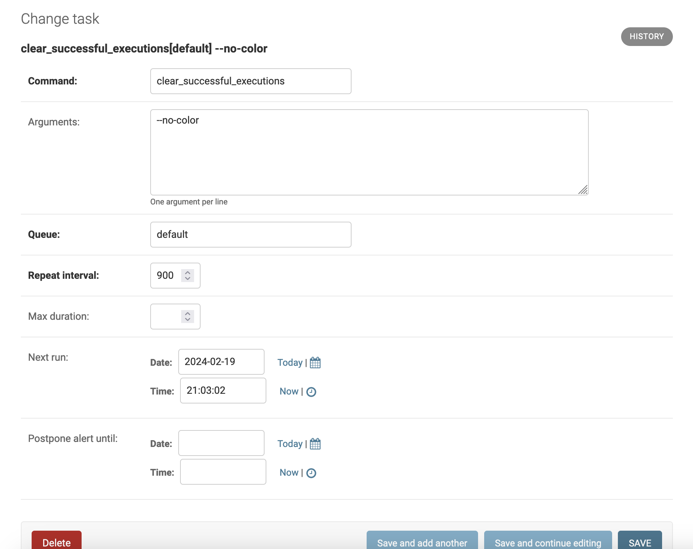
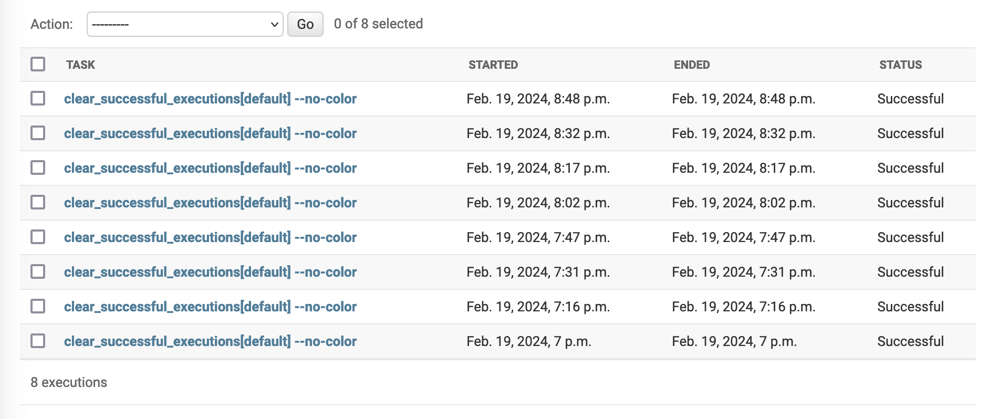

# Quicksilver for Django

[](https://circleci.com/gh/audacious-software/Quicksilver-Django)


Quicksilver is a sub-minute task scheduler designed to complement and improve upon CRON-based scheduling for running background processes. It was originally developed to provide "nudges" every couple of seconds (as opposed to no more frequently than once a minute with vanilla CRON) to conversational state machines provided by the [Django Dialog Engine](https://github.com/audacious-software/Django-Dialog-Engine) project. It quickly became a more generalized task dispatch system, and is in use across a variety of [Audacious Software](https://github.com/audacious-software/) (and adjacent) projects.

Quicksilver consists of three main types of primitives: *commands*, *tasks*, and *executions*.

A *command* consists of an annotated Django management command that exposes some additional arguments and returns some additional metadata when run. The [`clear_successful_executions`](/management/commands/clear_successful_executions.py) management command responsible for doing housekeeping within Quicksilver is an ideal example:

```python
# pylint: disable=no-member, line-too-long
# -*- coding: utf-8 -*-

from __future__ import print_function

import datetime
import logging

from django.core.management.base import BaseCommand
from django.utils import timezone

from ...decorators import handle_lock, handle_schedule, add_qs_arguments
from ...models import Execution

logger = logging.getLogger(__name__)

class Command(BaseCommand):
    help = 'Clears older Quicksilver successful task execution records.'

    @add_qs_arguments
    def add_arguments(self, parser):
        parser.add_argument('--before_minutes', required=False, type=int, default=120, help='Removes successful task executions older than provided minutes.')

    @handle_schedule
    @handle_lock
    def handle(self, *args, **options):
        before = timezone.now() - datetime.timedelta(seconds=(60 * options['before_minutes'])) # pylint: disable=superfluous-parens

        deleted = Execution.objects.filter(ended__lte=before, status='success').delete()[0]

        if int(options['verbosity']) > 1:
            logging.info('Cleared %s task execution record(s).', deleted)
```

When run, this command inspects the log of Quicksilver executions (more on these below) and deletes from the database all successful executions older than a certain date. Executions that did not successfully exit - or are still ongoing - are left on the system for diagnostic purposes.

This fairly-standard Django management command only differs from others in that the `add_arguments` method is annotated with `@add_qs_arguments` and the standard `handle` method is annotated with `@handle_lock` and `@handle_schedule`.

The `@add_qs_arguments` and `@handle_schedule` decorators are used to pass metadata between the command and the Quicksilver process starting those commands to generate estimates the next time the task (more on this below) should be run. The `@handle_lock` decorator allows the command to automatically grab a ["lock"](https://en.wikipedia.org/wiki/Lock_(computer_science)) so that no other instances of the command may run concurrently.

This housecleaning job is configured run every 15 minutes.

So, while a command is job encapsulated by the standard Django management command framework, with some Quicksilver-specific annotations, a *task* is an object that resides in the database and is used to specify how the command should be run.



Aside from the command itself, the most important part of a task is its *repeat interval* which is how many seconds must elapse before it should run again. In the case of `clear_successful_executions` 900 seconds (15 minutes) is a pretty standard interval. Additional arguments can be passed to the command to modify how it runs, and the task keeps track of the next time the command is scheduled to run, as well as how long to postpone any alerts (more on these below) should a command take longer than expected to run.



When a task becomes due to run a command, Quicksilver encapsulates this in an *execution*. An execution has a start time, and end time (may be empty if still running or is stuck) and a status. Statuses may be one of:

* **Successful**: The command finished successfully.
* **Error**: An error was encountered running the command.
* **Pending**: The command is scheduled to run in the future, but has not run yet.
* **Killed (Stuck)**: The command was terminated prematurely by the operating system.
* **Ongoing**: The command is still running (or has been terminated without Quicksilver being notified).

In the event of an error or other problem, Quicksilver attempts to log details of the failure to the execution's `Output` field. This is where troubleshooting begins if commands are not finishing successfully.

As commands are running, the Quicksilver system itself can be configured with external monitoring systems to detect when particular executions are taking longer than expected. This is defined as two standard deviations from the average of all the observed successful runs on the system. If such an outlier is detected, the local Django administrators (defined in `settings.ADMINS`) will receive an alert e-mail about the long-running job so that an investigation can begin if needed. After sending the alert, Quicksilver will set a window during which no more alert e-mails will be transmitted, in order to avoid flooding administrator inboxes with alerts.

## Installing Quicksilver

To install Quicksilver, clone this repository into your existing Django project:

```
$ git clone https://github.com/audacious-software/Quicksilver-Django.git quicksilver
```

Add `quicksilver` to `settings.INSTALLED_APPS`.

Optionally, add Quicksilver to your project's `urls.py` file:

```
urlpatterns = [
    path('admin/', admin.site.urls),
    url('^accounts/', include('django.contrib.auth.urls')),
    ...
    url(r'^quicksilver/', include('quicksilver.urls')),
]
```

This will enable support for third party monitoring systems to periodically poll for any issues on the local `/quicksilver/status` HTTP endpoint.

## Running Quicksilver from CRON

The Quicksilver task runner is implemented as a Django management command itself: `run_task_queue`. To run this command, within your own CRON setup, include a rule to start this command every minute:

```
* * * * *    source /var/www/django/my_site/venv/bin/activate && python /var/www/django/my_site/my_site/manage.py run_task_queue
* * * * *    source /var/www/django/my_site/venv/bin/activate && python /var/www/django/my_site/my_site/manage.py run_task_queue --task-queue other-task-queue
```

The first line sets up the `default` queue's task runner. The second line sets up an independent task runner for commands configured to use `other-task-queue`.

When CRON first starts this `run_task_queue`, the command will grab a file lock so that subsequent invocations while it's running will exit quickly. After a set period of time (30 minutes by default), `run_task_queue` will voluntarily exit so that its Python process may exit, and any bound memory resources from past jobs may be released back to the operating system. When the CRON clock ticks to the next minute, the job will restart and continue running scheduled tasks.


## Adding new Quicksilver tasks

To add your own tasks to Quicksilver, the first step is to build an appropriate Django management command, as shown above with `clear_successful_executions`. Note that the `@add_qs_arguments` and `@handle_schedule` decorators are **required**, but you may omit `@handle_lock` if your job does not require exclusive access to a resource.

Once you have created your new Quicksilver-compatible command, the next step is to add a `quicksilver_api.py` file to same package where your command resides and implement the `quicksilver_tasks` function:

```python
def quicksilver_tasks():
    return [
        ('my_new_command', '--my-command-line-arguments', 5,),
        ('my_other_command', '--my-command-line-arguments', 30, 'other-task-queue'),
    ]
```

This function simply returns a list of Python tuples defining the tasks you'd like created. The first item in the tuple (e.g. `my_new_command`) is the name of the command to run. The second item in the tuple is a string of command line arguments that should be passed when run. (This string may be empty.) The third item in the tuple is the repeat interval (in seconds) defining how often the job should run. The optional fourth item is the name of the process managing the jobs. For long-running jobs like backups and data exports, it's often very helpful to run these jobs in their own dedicated processes so that a healthy long-running task does not block other jobs from running.

After implementing `quicksilver_tasks` in your app's `quicksilver_api.py` file, run the `install_quicksilver_tasks` management command and Quicksilver will inspect your Django project's packages for any Quicksilver tasks to install. If any are found, it will add them to your site for scheduling:

```
(venv) ubuntu@clients:/var/www/django/my_site$ ./manage.py install_quicksilver_tasks
Installed ('clear_successful_executions', '--no-color', 900)...
Installed ('simple_messaging_send_pending_messages', '--no-color', 5)...
Installed ('nudge_active_sessions', '--no-color', 10)...
(venv) ubuntu@clients:/var/www/django/my_site$
```

If [Django Nagios Monitoring](https://github.com/audacious-software/Django-Nagios-Monitoring) is installed alongside Quicksilver, Django itself will let you know when you have packages with uninstalled Quicksilver tasks:

```
System check identified some issues:

WARNINGS:
?: (quicksilver.quicksilver.clear_successful_executions.W001) Quicksilver task "quicksilver.clear_successful_executions" is not installed
	HINT: Run "install_quicksilver_tasks" command to install or add "quicksilver.quicksilver.clear_successful_executions.W001" to SILENCED_SYSTEM_CHECKS.
?: (quicksilver.simple_messaging_dialog_support.nudge_active_sessions.W001) Quicksilver task "simple_messaging_dialog_support.nudge_active_sessions" is not installed
	HINT: Run "install_quicksilver_tasks" command to install or add "quicksilver.simple_messaging_dialog_support.nudge_active_sessions.W001" to SILENCED_SYSTEM_CHECKS.
?: (quicksilver.simple_messaging_dialog_support.simple_messaging_send_pending_messages.W001) Quicksilver task "simple_messaging_dialog_support.simple_messaging_send_pending_messages" is not installed
	HINT: Run "install_quicksilver_tasks" command to install or add "quicksilver.simple_messaging_dialog_support.simple_messaging_send_pending_messages.W001" to SILENCED_SYSTEM_CHECKS.
```


## Questions?

If you have any questions or need assistance, please e-mail [chris@audacious-softare.com](mailto:chris@audacious-software.com). This is still a project under active development (despite over four years of production deployments), so there will still be rough spots.


## License and Other Project Information

Copyright 2020-2024 Audacious Software

Licensed under the Apache License, Version 2.0 (the "License"); you may not use this file except in compliance with the License. You may obtain a copy of the License at

[http://www.apache.org/licenses/LICENSE-2.0](http://www.apache.org/licenses/LICENSE-2.0)

Unless required by applicable law or agreed to in writing, software distributed under the License is distributed on an "AS IS" BASIS, WITHOUT WARRANTIES OR CONDITIONS OF ANY KIND, either express or implied. See the License for the specific language governing permissions and limitations under the License.


